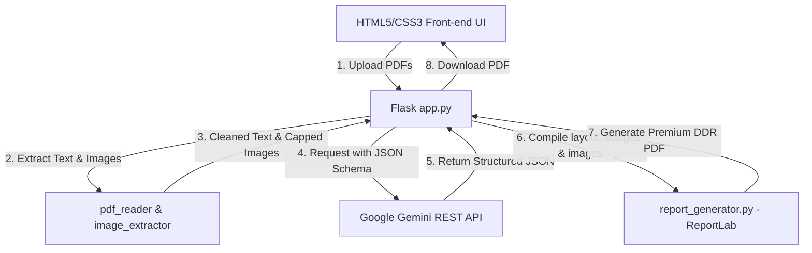

# AI DDR Report Generator (Detailed Diagnostic Report)

The **AI DDR Report Generator** is an automated, Python-based AI diagnostic system that merges visual building Inspection Reports and infrared Thermal Diagnostic Reports to generate a professional, publication-grade **Detailed Diagnostic Report (DDR)** in PDF format.

Built using **Flask, PyMuPDF, ReportLab, and the Google Gemini API**, it simplifies property assessment workflows by automating contradiction checking, severity analysis, and image mapping.

---

## 🌟 Key Features

1. **Dual PDF Ingestion**: Accepts visual inspection and thermographic scans concurrently.
2. **Robust Text Parsing**: Extracts text page-by-page using PyMuPDF (`fitz`) with fallback to `pdfplumber`.
3. **Smart Image Extraction & Token Optimization**:
   - Extracts diagnostic photos from PDF pages while automatically ignoring grid lines, borders, and layouts (filtering files $< 150\times150$ pixels).
   - Enforces page-wise caps (max 5 images/page) and document caps (max 50 images/doc) to reduce prompt sizes by up to 90%, preventing API rate-limiting blocks.
4. **Structured AI Diagnosis**:
   - Queries Gemini (`gemini-2.5-flash`) via HTTPS REST utilizing a strict `responseSchema` to guarantee JSON format alignment.
   - Summarizes issues, outlines area-wise observations, performs root cause analyses, and details actionable recommendations.
5. **Dynamic Conflict Detection**: Compares reports to detect contradictions (e.g. visual dampness noted but thermal scan shows dry signatures) and outputs clear physical inspection recommendations in dedicated alert boxes.
6. **Premium PDF Compilation**: Compiles findings into a professionally styled PDF containing colored severity badges (Low/Medium/High/Critical), dynamic page tracking ("Page X of Y"), and embedded page images with italicized fallbacks.
7. **Secure-by-Design Architecture**:
   - Employs custom synchronizer CSRF tokens on uploads.
   - Prevents XSS via framework auto-escaping and DOM `textContent` bindings.
   - Avoids directory traversal by sanitizing served downloads and renaming uploads to UUID-based hashes.

---

## 🛠️ Technology Stack

- **Backend**: Python 3.12+, Flask 3.0+
- **Parsing Libraries**: PyMuPDF (`fitz`), pdfplumber
- **Graphics/Imaging**: Pillow (`PIL`)
- **PDF Compiler**: ReportLab
- **AI Connectivity**: Requests (HTTP Client querying Gemini API REST)

---

## 🏗️ Architecture & Data Flow



---

## 🚀 Installation & Setup

### 1. Clone the repository
```bash
git clone https://github.com/Parth-Mulay/ai-ddr-report-generator.git
cd ai-ddr-report-generator
```

### 2. Set up a virtual environment
```bash
python -m venv venv
# On Windows (PowerShell):
venv\Scripts\Activate.ps1
# On macOS/Linux:
source venv/bin/activate
```

### 3. Install dependencies
```bash
pip install -r requirements.txt
```

### 4. Configure environment variables
Create a `.env` file in the root directory:
```env
GEMINI_API_KEY=your_gemini_api_key_here
FLASK_SECRET_KEY=your_custom_flask_secret_key
FLASK_ENV=development
PORT=5000
```

### 5. Run the server
```bash
python app.py
```
Open **[http://127.0.0.1:5000](http://127.0.0.1:5000)** in your browser.

---

## 🔒 Security Practices

- **CSRF Guards**: Enforced on the `/generate` upload endpoint using Session-bound tokens.
- **Content Validation**: File uploads are restricted to `.pdf` extensions and validated by inspecting the `%PDF` binary header before execution.
- **Size Capping**: Imposes a hard request size limit of 16MB to prevent buffer overflow or DoS attempts.
- **Directory Isolation**: Serves compiled PDFs with standard security headers (`X-Content-Type-Options: nosniff` and `X-Frame-Options: DENY`).
- **Loopback Binding**: By default, the development server is restricted to local loopback binding (`127.0.0.1`) to prevent external network ingress.
